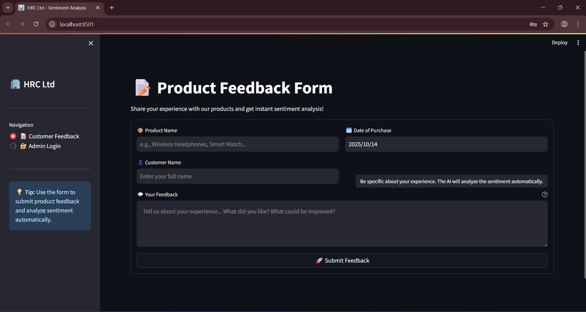
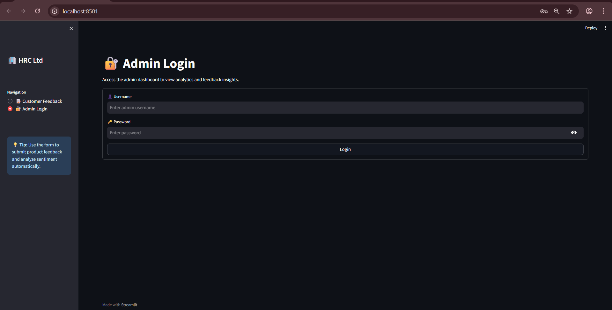
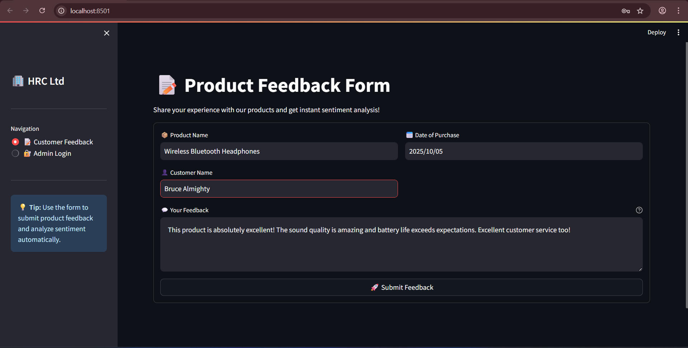
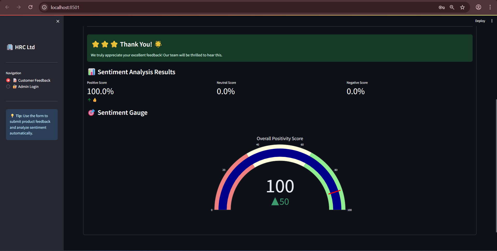

# NLP Sentiment Analysis Dashboard 💬📊

This project is an **NLP Sentiment Analysis Dashboard** that allows customers to provide product feedback and receive automated responses based on their sentiment. The admin can view all feedback received, with a dashboard showing the percentage of positive, negative, and neutral feedback.

## Features 🛠️

### 1. **Customer Feedback System** 📝
   - **Input Fields**: 
     - Customers can enter the following details:
       - **Product Name** 🏷️
       - **Purchase Date** 📅
       - **Feedback** 💭
   - **Sentiment Analysis**:
     - The customer's feedback is analyzed using a sentiment analysis model (RoBERTa).
     - Based on the sentiment (Positive, Negative, Neutral), the system generates a pre-generated response to the customer. 🎉

### 2. **Admin Dashboard** 🖥️
   - **Admin Login** 🔑:
     - The admin can log in using the credentials:
       - **Username**: `Hari` 🧑‍💼
       - **Password**: `User2` 🔒
   - **Dashboard** 📊:
     - The admin can view the reviews submitted by customers.
     - The dashboard shows the percentage breakdown of feedback:
       - **Positive Feedback** ✅
       - **Negative Feedback** ❌
       - **Neutral Feedback** 🤖

## Technologies Used 🧑‍💻

### Frontend 🌐:
   - **Streamlit**: Modern web application framework for ML and Data Science Projects
   - **Ploty**: Interactive charts and visualizations

### Backend 🔙:
   - **Streamlit**: A lightweight web framework used to handle HTTP requests, route traffic, and integrate with the frontend. 

### Model 🤖:
   - **RoBERTa**: A pre-trained transformer model for sentiment analysis that is used to analyze customer feedback and classify the sentiment as Positive, Negative, or Neutral.

## How to Run the Project 🚀

### 1. **Install Dependencies** 🛠️:
   - Clone the repository to your local machine:
     ```bash
     git clone https://github.com/Girijesh-S/Nlp_Sentiment_Analysis_Dashboard.git
     ```
   - Navigate to the project folder:
     ```bash
     cd Nlp_Sentiment_Analysis_Dashboard
     ```
   - Install the required Python libraries:
     ```bash
     pip install -r requirements.txt
     ```

### 2. **Run the Streamlit Backend** 🏃‍♂️:
   - Start the Streamlit server:
     ```bash
     streamlit run streamlit_app.py
     ```
   - The application will be available at `http://localhost:8601`.

## Admin Login Credentials 🔑:
   - **Username**: `Girijesh`
   - **Password**: `User1`

## 📸 Screenshots

Screenshots are available in the `/screenshots` folder.  
Example:







---

## Contributing 🤝
Feel free to fork the repository, submit pull requests, or open issues if you encounter any bugs or have feature suggestions.

## License 📄
This project is licensed under the MIT License - see the [LICENSE](LICENSE) file for details.
